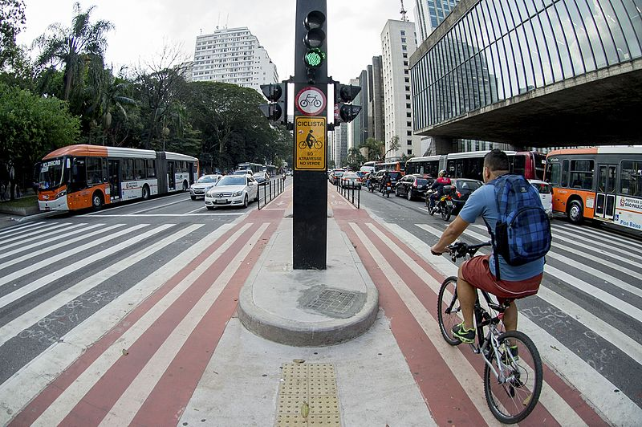

<style>
body {
text-align: justify}
</style>

```{r leitura das bases, include=FALSE}

library(tidyverse)
library(data.table)


obitos <- read.csv2("../dados/obitos_publico.csv")

a_fatais <- readxl::read_excel("../dados/acidentes_fatais.xlsx")
data.table::setDT(obitos)
data.table::setDT(a_fatais)

dia <- lubridate::dmy(params$diaRef)

```

## Justificativa

O presente relatório é o trabalho final do curso de Relatórios Reprodutíveis com R, do IME-USP, em 2022.

## Objetivos

O objetvo do relatório é comparar os dados sobre acidentes fatais envolvendo ciclistas no município de São Paulo/BR entre os períodos de `r params$qtdeAnos` `r ifelse(params$qtdeAnos>1, 'anos','ano')` antes e depois de uma data determinada como parâmetro. Como exemplo, foi considerada a data de início da pandemia de  COVID-19.


```{r imagem, echo=FALSE, out.width = "70%", fig.align = 'center'}



```


## Fontes 

A data considerada como início da pandemia de COVID-19 é 11/03/2020, seguindo o que foi estabelecido pela Organização Mundial da Saúde^[Mais informações em  https://www.paho.org/pt/covid19/historico-da-pandemia-covid-19]. A data de referência pode ser alterada a depender do objetivo da análise.


As bases de dados utilizadas na análise são provenientes do Governo do Estado de São Paulo e estão disponíveis no portal http://www.respeitoavida.sp.gov.br/relatorios/. 


Os links para donwload estão disponíveis aqui:

- [Óbitos](http://painelderesultados.infosiga.sp.gov.br/bases/obitos_publico.csv)

- [Acidentes fatais](http://painelderesultados.infosiga.sp.gov.br/bases/acidentes_fatais.xlsx)

```{r tratamento bases, include=FALSE}

# Tratando duplicações na base de óbitos para levar informações de 'tipo de veículo da vítima' para a base de acidentes fatais.

data.table::setorder(obitos, Ano.do.BO..RDO., Id.da.Delegacia..RDO., Número.do.Bo..RDO.)

obitos[, c := 1:.N, by = c("Id.da.Delegacia..RDO.", "Número.do.Bo..RDO.", "Ano.do.BO..RDO.")]

obitos2 <- obitos[, .(Ano.do.BO..RDO.,
                      Id.da.Delegacia..RDO.,
                      Número.do.Bo..RDO.,
                      c,
                      Tipo.do.veículo.da.vítima)]

setnames(obitos2, 'Tipo.do.veículo.da.vítima', 'veic_vit')

# base de óbitos com acidentes na linha e tipos de veículos das vítimas nas linhas
obitos2 <- dcast(obitos2,
                 Ano.do.BO..RDO. + Id.da.Delegacia..RDO. + Número.do.Bo..RDO. ~ c,
                 value.var = "veic_vit")

# tratamento dos nomes para o join com a a_fatais
setnames(obitos2, 
         c("Ano.do.BO..RDO.",
           "Id.da.Delegacia..RDO.",
           "Número.do.Bo..RDO.",
           colnames(obitos2[,4:ncol(obitos2)])),
         c("Ano BO (RDO)",
           "Id Delegacia (RDO)",
           "Número BO (RDO)",
           paste("vitima", 
                 colnames(obitos2[,4:ncol(obitos2)]),
                                         sep = "_")
           )
         )


# variáveis de identificação da base obitos2 como character

obitos2[,1:3] <- lapply(obitos2[,1:3], as.character)

# trazendo informações de veículos das vítimas para a base de acidentes

a_fatais2 <- dplyr::left_join(a_fatais, 
                              obitos2, 
                              by = c("Ano BO (RDO)",
                                     "Id Delegacia (RDO)",
                                     "Número BO (RDO)"))

# criando variáveIS de identificação de acidentes com óbitos de CICLISTAS


a_fatais2 <- a_fatais2 |> 
  mutate(N_vit_ciclistas = rowSums(across(vitima_1:ncol(a_fatais))== "BICICLETA",
                                 na.rm = TRUE)) |>
  mutate(vit_ciclistas = ifelse(N_vit_ciclistas > 0, "Sim", "Não"))

# identificação acidentes antes ou depois da data de referência na base de acidentes fatais

a_fatais2 <- a_fatais2 |> 
  mutate(data_referencia = ifelse(`Data do Acidente` < dia - params$qtdeAnos*365.25 | 
                                    `Data do Acidente` > dia + params$qtdeAnos*365.25,
                                         "fora do escopo",
                                  ifelse(`Data do Acidente` > dia - params$qtdeAnos*365.25 & `Data do Acidente` <= dia,
                                         "Antes",
                                         "Depois")))


# identificação acidentes antes ou depois da data de referência na base de obitos

obitos <- obitos |> 
  mutate(data_referencia = ifelse(Data.do.Acidente < dia - params$qtdeAnos*365.25 |
                                    Data.do.Acidente > dia + params$qtdeAnos*365.25 ,
                                         "fora do escopo",
                                  ifelse(Data.do.Acidente > dia - params$qtdeAnos*365.25
                                         & Data.do.Acidente <= dia,
                                         "Antes",
                                         "Depois")
                                  )
         )


# criando variáveIS de identificação de ano- mês do acidente na base obitos

obitos <- obitos |>
  mutate(Ano.mes.acidente = substring(Data.do.Acidente, 1, 7))


```


## Resumo dos números

```{r resumos, include=FALSE}

# criação dos resumos

# número total de acidentes fatais de ciclistas antes da referência

n_ac_antes <- a_fatais2 |> 
  filter(vit_ciclistas == "Sim" & 
           data_referencia == "Antes" & 
           Município == params$municipio) |>
  nrow()

# media por mês antes da referência

med_ac_antes <- a_fatais2 |> 
  filter(vit_ciclistas == "Sim" & 
           data_referencia == "Antes" & 
           Município == params$municipio) |>
  select(`Ano/Mês do Acidente`) |>
  group_by(`Ano/Mês do Acidente`) |>
  count() |>
  ungroup()

med_ac_antes <- round(mean(med_ac_antes$n),1)


# número total de acidentes fatais de ciclistas depois da referência

n_ac_depois <- a_fatais2 |> 
  filter(vit_ciclistas == "Sim" &
           data_referencia == "Depois" & 
           Município == params$municipio) |>
  nrow()

# media por mês depois da referência

med_ac_depois <- a_fatais2 |> 
  filter(vit_ciclistas == "Sim" 
         & data_referencia == "Depois" 
         & Município == params$municipio) |>
  select(`Ano/Mês do Acidente`) |>
  group_by(`Ano/Mês do Acidente`) |>
  count() |>
  ungroup()

med_ac_depois <- round(mean(med_ac_depois$n),1)

# diferença em percentual entre os dois períodos

dif_perc <- round(abs((n_ac_depois-n_ac_antes)/n_ac_antes)*100,1)

# texto dinâmico

txt_din <- ifelse(n_ac_depois-n_ac_antes > 0, "um aumento", "uma redução")

```


No período de `r params$qtdeAnos` `r ifelse(params$qtdeAnos>1, 'anos','ano')` antes de `r params$diaRef`, ocorreram `r n_ac_antes` acidentes com mortes de ciclistas, com uma média de `r med_ac_antes` acidentes por mês. 

Já no período de `r params$qtdeAnos` `r ifelse(params$qtdeAnos>1, 'anos','ano')` depois de `r params$diaRef`, ocorreram `r n_ac_depois` acidentes com mortes de ciclistas, com uma média de `r med_ac_depois` acidentes por mês, `r txt_din` de `r dif_perc`% em relação ao período anterior.

```{r tabela, echo=FALSE}

quantidade <- a_fatais2 |>
  filter(vit_ciclistas == "Sim" &
           data_referencia != "fora do escopo"&
           Município == params$municipio) |>
  select(data_referencia) |>
  group_by(data_referencia) |>
  count()

knitr::kable(quantidade, col.names = c("Período em relação à referência", "Quantidade de acidentes"))|>
  kableExtra::kable_styling(full_width = F)

```


## Gráficos 

### Número de acidentes com óbitos de ciclistas - `r params$qtdeAnos` `r ifelse(params$qtdeAnos>1, 'anos','ano')` antes e depois de `r params$diaRef` (data de referência)


```{r grafico acidentes, echo=FALSE}

a_fatais2 |>
  filter(vit_ciclistas == "Sim" &
           data_referencia != "fora do escopo"&
           Município == params$municipio) |>
  select(`Ano/Mês do Acidente`, data_referencia) |>
  group_by(`Ano/Mês do Acidente`, data_referencia) |>
  count() |>
  ungroup() |>
  mutate(`Ano/Mês do Acidente` = lubridate::ym(`Ano/Mês do Acidente`)) |>
  ggplot(aes(`Ano/Mês do Acidente`, n)) +
  geom_col(aes(fill = data_referencia))+
  geom_text(aes(label = n),
             position = position_dodge(0.9),
             vjust = 0) +
  scale_x_date(date_labels = "%m/%y", 
               date_breaks = "2 months") +
  labs(x = "Meses", y = "Número de acidentes") +
  theme_bw() +
  theme(axis.text.x = element_text(angle = 45, 
                                   vjust = 0.5),
        legend.position="none") +
  facet_grid(cols = vars(data_referencia),
             scales = "free", 
             labeller = as_labeller(c("Antes" = "Antes da referência",
                                      "Depois" = "Depois da referência")))


```

### Óbitos de ciclistas - `r params$qtdeAnos` `r ifelse(params$qtdeAnos>1, 'anos','ano')` antes e depois de `r params$diaRef` (data de referência) 


```{r grafico obitos, echo=FALSE}

obitos |>
  filter(Tipo.do.veículo.da.vítima == "BICICLETA" &
           data_referencia != "fora do escopo"&
           Município == params$municipio) |>
  select(Ano.mes.acidente, data_referencia)  |>
  group_by(Ano.mes.acidente, data_referencia) |>
  count() |>
  ungroup() |>
  mutate(Ano.mes.acidente = lubridate::ym(Ano.mes.acidente)) |>
  ggplot(aes(Ano.mes.acidente, n)) +
  geom_col(aes(fill = data_referencia))+
  geom_text(aes(label = n),
             position = position_dodge(0.9),
             vjust = 0) +
  scale_x_date(date_labels = "%m/%y", 
               date_breaks = "2 months") +
  labs(x = "Meses", y = "Número de acidentes") +
  theme_bw() +
  theme(axis.text.x = element_text(angle = 45, 
                                   vjust = 0.5),
        legend.position="none") +
  facet_grid(cols = vars(data_referencia),
             scales = "free", 
             labeller = as_labeller(c("Antes" = "Antes da referência",
                                      "Depois" = "Depois da referência")))
 
```


